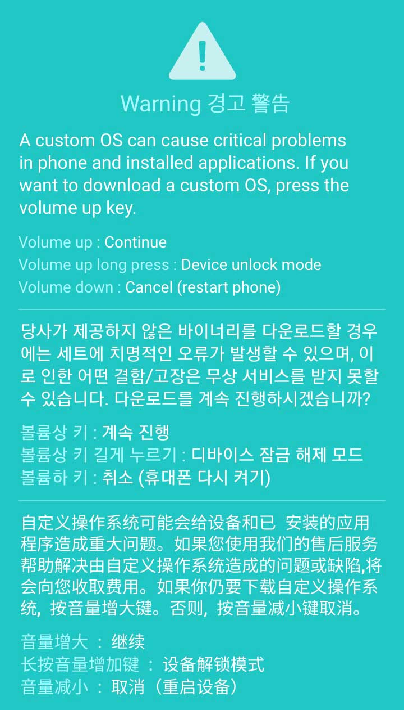
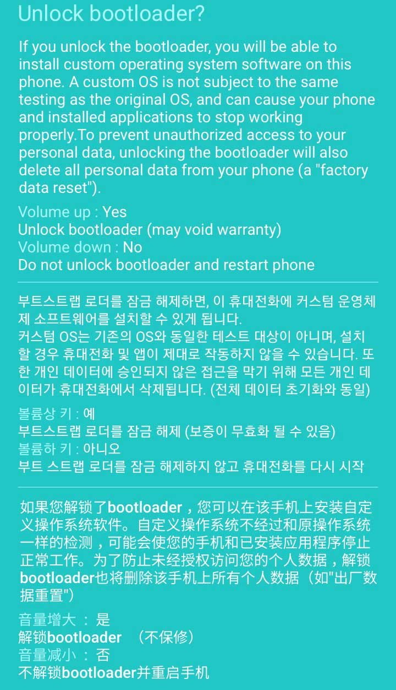
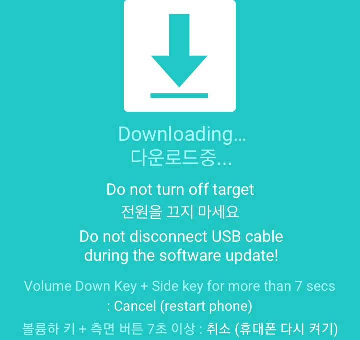
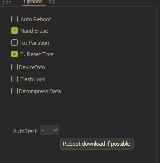
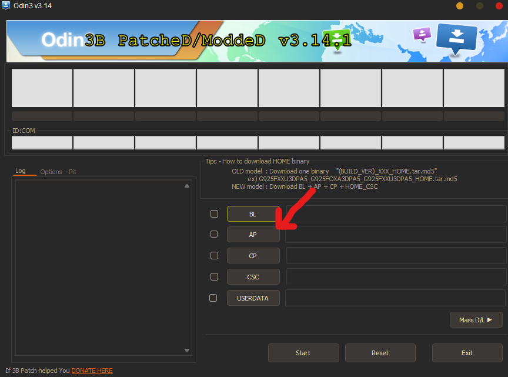
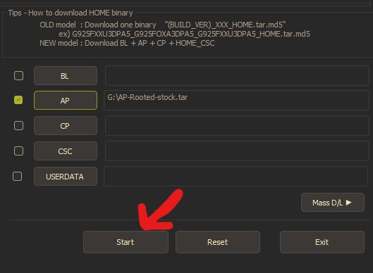

# Samsung Galaxy A12s (sm-a127f/ds)

##### A simple guide to root and install a GSI in the sm-a127f/ds devices and many more customizations

> [!warning]  
> **I am not responsible for bricked or broken devices!** You are doing this out of your free will!!  
> **All Data will be Lost** - You are responsible for your data

## Index

- [Prerequisites](#prerequisites)
- [Required Files](#files)
- [Rooting Process](#rooting)
  - [Step 1: Unlocking the OEM](#step-1-unlocking-the-oem)
  - [Step 2: Flashing Rooted AP](#step-2-flashing-rooted-ap)
- [Additional Guides](#additions)
  - [Rooting AP Using Magisk](#rooting-ap-using-magisk)

---

## Prerequisites

- A Samsung A12s device
- A qualified USB cable
- A PC preferably Windows
- A lot of patience and a working brain

## Files

| File         | Download Link                                                                                                                  |
| ------------ | ------------------------------------------------------------------------------------------------------------------------------ |
| Stock ROM    | [Download](https://samfw.com/firmware/SM-A127F)                                                                                |
| Rooted AP    | [Download](https://sourceforge.net/projects/sm-a127f-root-gsi-guide/files/files/Rooted-AP/AP-Rooted-stock.tar/download)        |
| Odin Patched | [Download](https://forum.xda-developers.com/attachments/odin3-v3-14-1_3b_patched-zip.5158507/)                                 |
| TWRP         | [Download](https://github.com/edward0181/android_device_samsung_a12/releases/download/twrp-3.6.1_11-1/twrp-3.6.1_11-1-a12.img) |

### GSI Files

| File                    | Download Link                                     |
| ----------------------- | ------------------------------------------------- |
| Lineage OS              | [Download](#) (coming soon!)                      |
| Kernel                  | [Download](/files/kernel/kernel-perm-ksu.zip)     |
| Magisk APK              | [Download](/files/apks/magisk.apk)                |
| Touch Fix               | [Download](/files/magisk-modules/Touch-fix.zip)   |
| GApps                   | [Download](/files/magisk-modules/MagiskGApps.zip) |
| Device ID               | [Download](/files/apks/deviceid.apk)              |
| GSI Customization Files | [Download](/customization/)                       |

---

## Rooting

> [!CAUTION] > **All data will be erased during this process. Back up any important data before proceeding.**

For those who want the latest Magisk, go to the [Rooting AP Using Magisk](#rooting-ap-using-magisk) section.

### Step 1: Unlocking the OEM

For a better visual guide, check [THIS VIDEO TUTORIAL](https://www.youtube.com/watch?v=8Y0BKZXChiA).

1. Go to **Settings** > **About phone** > tap the build number 5-7 times until Developer options are unlocked
2. Go back to Settings main page and scroll down until you see **Developer options**
3. Enable the **OEM unlock** option and shutdown your phone
4. On your PC, download the files from the [Files section](#files)
5. Extract the Odin file and open it
6. Connect the USB cable to the PC (**_DO NOT CONNECT TO PHONE YET_**)
7. Press the **Volume Up** and **Volume Down** buttons simultaneously and connect the cable to the phone
8. Hold the **Volume Up** button when you see this screen:

   

     
     
<i>Warning Screen</i>

   

9. Press **Volume Up** to fully unlock the OEM

   

     
     
<i>Device Unlock Screen</i>

   

10. Disconnect the cable from the phone
11. Your phone will shutdown and reset itself. Power off your phone.
12. Press the **Volume Up** and **Volume Down** buttons simultaneously and connect the cable to the phone
13. Press **Volume Up** when prompted

    

      
      
<i>Warning Prompt</i>

    

14. You will be greeted with this download mode screen:

    

      
      
<i>Download Mode</i>

    

### Step 2: Flashing Rooted AP

1. Download the rooted AP from the [Files section](#files) or follow the [Rooting AP Using Magisk](#rooting-ap-using-magisk) guide
2. Open Odin on your PC
3. Apply these options in the Options tab:

   

     
     
<i>Odin Options Configuration</i>

   

4. Select the AP button and browse for the downloaded .tar file:

   

     
     
<i>Selecting AP File in Odin</i>

   

5. Click Start:

   

     
     
<i>Odin with AP File Selected</i>

   

6. Wait for the process to complete. You'll see a "PASS!" message when successful.
7. Your phone will reboot automatically and should now be rooted!

---

## Additions

### Rooting AP Using Magisk

If you prefer using the latest version of Magisk instead of the pre-rooted AP:

1. Download the Magisk app from [GitHub Releases](https://github.com/topjohnwu/Magisk/releases)
2. Download the stock firmware [here](/files/apks/magisk.apk) according to your country type
3. Extract the stock firmware to a folder on your PC
4. Open Magisk app on another Android device (or emulator)
5. Tap on the **Install** button
6. Select **"Select and patch a file"**
7. In the browser, navigate to the extracted folder and select the AP file
8. Let Magisk patch the file (this may take several minutes)
9. When complete, download the resultant .tar file to your PC
10. Continue with the [Rooting guide's Step 2](#step-2-flashing-rooted-ap) using this patched file
