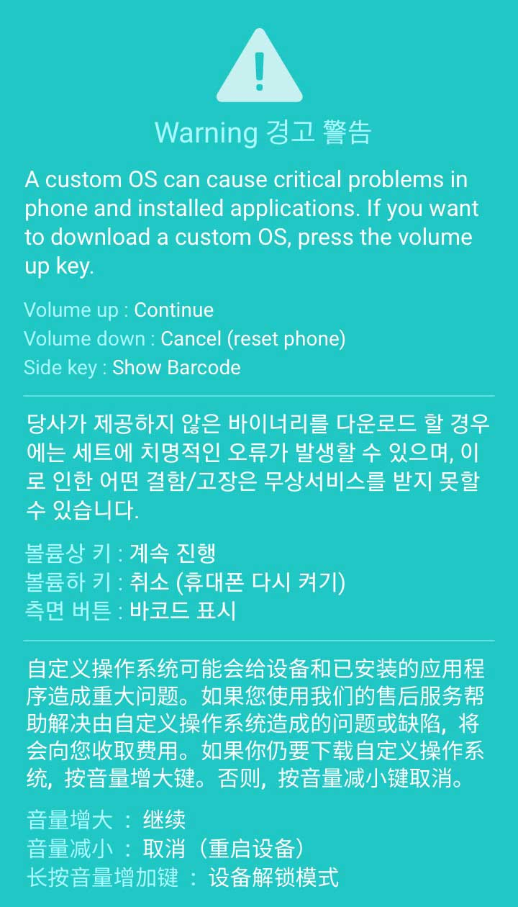

# Samsung Galaxy A12s (sm-a127f/ds)

##### A simple guide to root and install a GSI in the sm-a127f/ds devices and many more customizations

> [!warning] > **I am not responsible for bricked or broken devices!** you are doing this out of your free will !!..
> **All Data will be Lost** .. you are responsible for your data

## Index

- [**Rooting**](#rooting)
-

### Perquisites

- A Samsung A12s device
- A qualified USB cable
- A PC preferably Windows
- A lot of patience and a working brain

### Files

- [Stock rom file](https://samfw.com/firmware/SM-A127F)
- [Rooted AP](https://sourceforge.net/projects/sm-a127f-root-gsi-guide/files/files/Rooted-AP/AP-Rooted-stock.tar/download)
- [Odin patched](https://forum.xda-developers.com/attachments/odin3-v3-14-1_3b_patched-zip.5158507/)
- [TWRP](https://github.com/edward0181/android_device_samsung_a12/releases/download/twrp-3.6.1_11-1/twrp-3.6.1_11-1-a12.img)

##### For GSI

- [Lineage os](#)
- [kernel](/files/kernel/kernel-perm-ksu.zip)
- [magisk apk](/files/apks/magisk.apk)
- [Touch Fix](/files/magisk-modules/Touch-fix.zip)
- [Gapps](/files/magisk-modules/MagiskGApps.zip)
- [device id](/files/apks/deviceid.apk)
- [GSI customization files](/customization/)

---

### Rooting

> [!Caution]
> All data wil be erased

for the oes whow want he latest magisk go [here](#rooting-ap-using-magisk)

**Step 1:** Unlocking the oem

for a more better visual guide check [THIS](https://www.youtube.com/watch?v=8Y0BKZXChiA) video out

Go to settings > About phone > tap the build number 5 - 7 times until Developer options are unlocked
Now go back to settings main page and scroll down until you see the developer options
now click the OEM unlock option and shutdown your phone

now go to your pc and download the files [HERE](#files)

extract the odin file and open it

now connect the usb cabel to the pc DON'T CONNECT TO PHONE YET

now Press the vol up and vol down button simultaneously and connect the cabel to the phone
now here hold the volume up button

now here you press vol up to fully unlock the oem

disconnect the cabel form the phone
now your phone will shutdown and reset it self now power off your phone and now Press the vol up and vol down button simultaneously and connect the cabel to the phone

now here press vol up

and you will be greeted with this screen

now onto your pc

**Step 2:** Flashing rooted AP

Download the rooted AP from [here](#files) or follow this guide [here](#rooting-ap-using-magisk)

and open odin now
and apply these options in the otpions tab

select the ap button and browse for the downloaded .tar file and click start

now your phone should be rooted

## additions

#### rooting AP using magisk

download the magisk app form [here](https://github.com/topjohnwu/Magisk/releases)

and downlaod the stock firmware from [here](/files/apks/magisk.apk) according to your country type
and extract it now into magisk and click install and select 'select and patch a file' now in the browser go to the extarted folder and select the AP file and let it do its job and downlaod the resultant .tar file to your pac and continue the [guide](#rooting)
